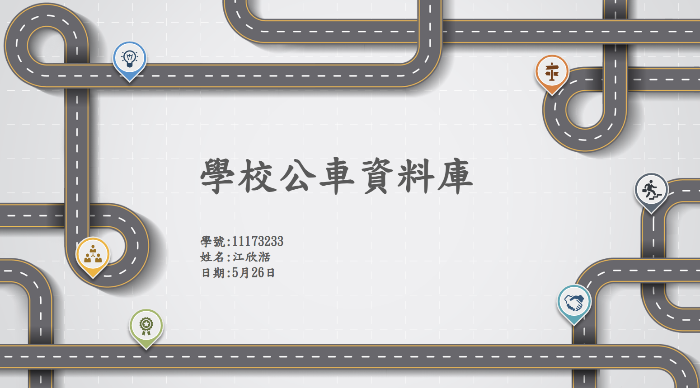
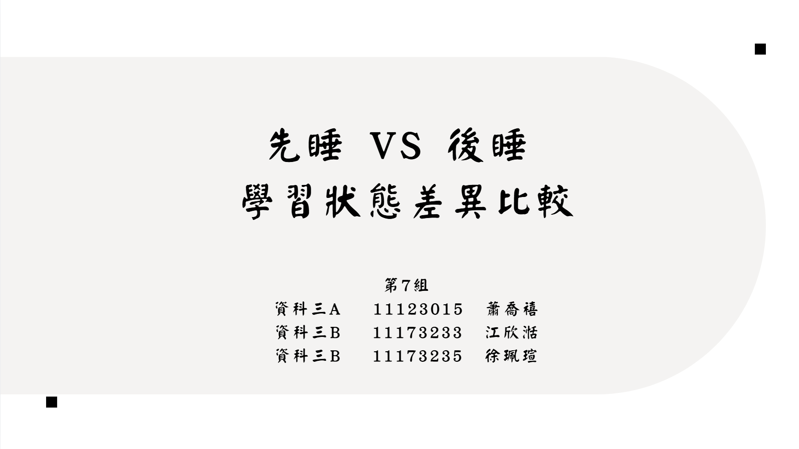
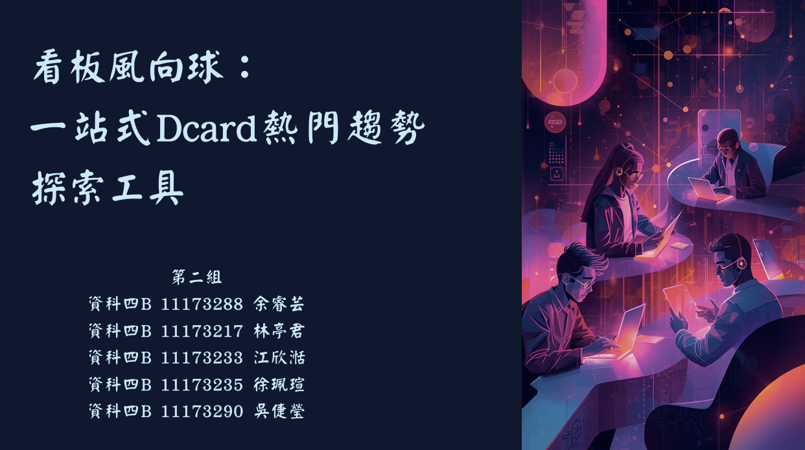

# 作品集

我的作品集一共分稱三個部分：&nbsp;比賽簡報、&nbsp;課程專題、&nbsp;畢業專題

## 一、比賽簡報

### 1、第二屆法國巴黎人壽校園黑客松競賽-榮獲 **團隊金獎**

#### (1)、作品名稱:癌症基因風險檢測保險_Gene不可失

結合基因檢測與癌症風險保險，以應對癌症年輕化、遺傳性癌症風險增加、傳統 保險賠付不足等挑戰。透過基因檢測，個人可了解罹癌風險，並依檢測結果彈性選擇適切的 保險方案。 本產品針對0至6歲嬰兒及孩童設計，經基因檢測後，根據風險配置保險點數，提供個性化 癌症保障。此保險設有彈性保費、終身保障及健康檢查補助等機制，結合訊聯基因的技術支 持，以求達到減緩經濟負擔，提升健康管理意識，為患者及家屬提供全方位支持的終旨。

作品連結:
https://reurl.cc/K9WR0m

### 2、113年度「櫃買30-大專生證券菁英種子線上培育營」

#### (1)、團隊名稱:通往億萬富翁之路

該培育營分下面兩階段進行：

#### (1.1)第一階段為線上學習課程 

課程內容包含我國資本市場特色與監理重點、認識證券櫃檯買賣中心、櫃買中心股票交易制度與實務介紹及ETF簡介及認識投資風險

#### (1.2)第二階段為櫃買商品投資組合線上簡報競賽

競賽題目：就新台幣50,000,000元可運用資金，規劃櫃買商品投資組合，簡報內容應包含總經及產業分析與投資組合分析。

資產配置商品範圍: 上櫃股票、興櫃股票、上櫃ETF(含債券ETF)、上櫃ETN、上櫃權證、上櫃債券等櫃檯買賣商品。

先透過總經、產業新聞、財報資訊及產業分析，進行各個產業發展趨勢的評估分析。

再從較具發展潛力的個別產業中，挑選該產業具發展潛力的個別公司。

最後分析並選出值得投資之個股建議。

作品連結:
https://reurl.cc/NxMgOn

## 二、課程專題

### 1、社群網路分析

利用二元編碼將每家公司有用到的兵法記作1，沒有用到的兵法記作0 ，接著利用ucinet 進行中心性分析，再用python畫社群網路圖，分析商場如戰場這句話是否為真。

作品連結:
https://reurl.cc/89aLAo

### 2、文字探勘

主要是通過分析病患在醫療機構網站或社交平台上的評論來評估病患滿意度，利用文字探勘技術進行情緒分析，為醫療機構提供提升服務品質的參考依據。

作品連結:
https://reurl.cc/qYR6GE

.pdf)

### 3、行為資料科學

.利用腦波儀去測先睡覺後學習的狀態和先學習後睡覺的學習狀態
.使用cmd將腦波儀中的資料導出
.將導出資料進行傅立葉轉換，並進行分析

作品連結: 
https://reurl.cc/lpN0Lj

### 4、資料庫導論

使用 SQL 建立關聯式資料庫
寫查詢語法進行資料檢索與分析
整合公車資料與使用者資料，提升查詢效率

作品連結: 
https://reurl.cc/Ga5omv

## 三、畢業專題

主要是建置一個互動式的「Dcard看板風向球」平台，並將 Dcard 五大看板（工作、研究所、美食、旅遊、考試）的討論內容整理成像是文字雲、排行榜與圖表等視覺化方式，讓使用者在不必自己撈資料的情況下，就能快速掌握各看板的關注焦點與變化方向。

以下是我們畢業專題的簡報連結:
https://reurl.cc/xWLz8V

